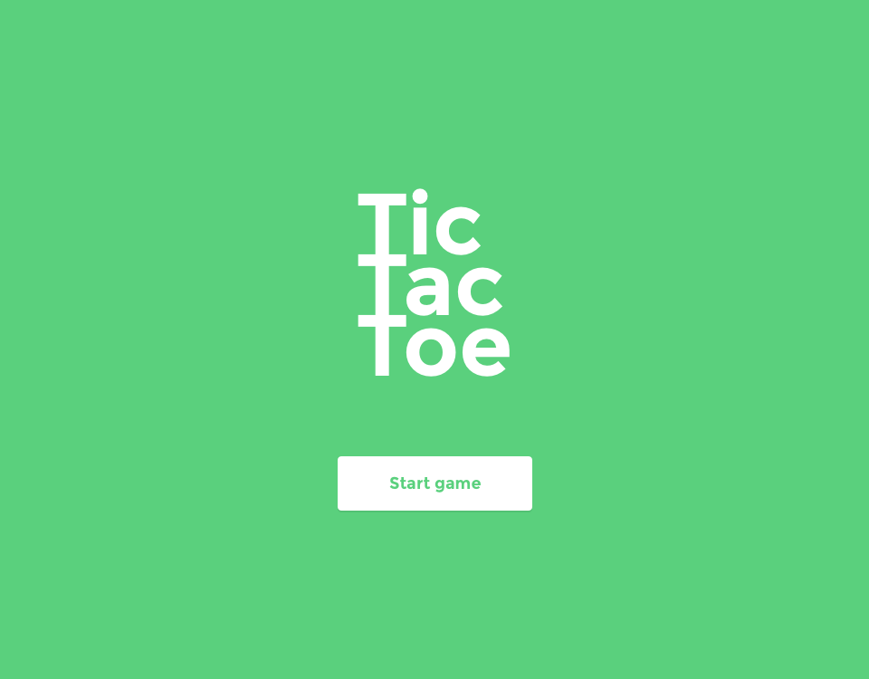
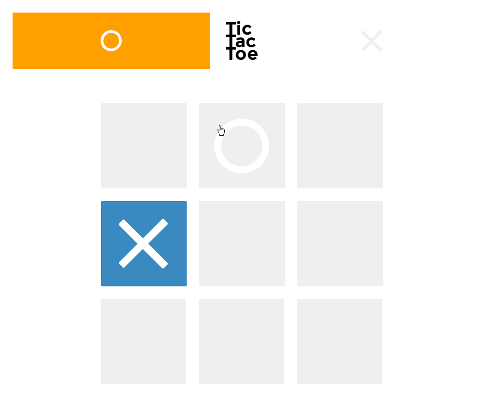
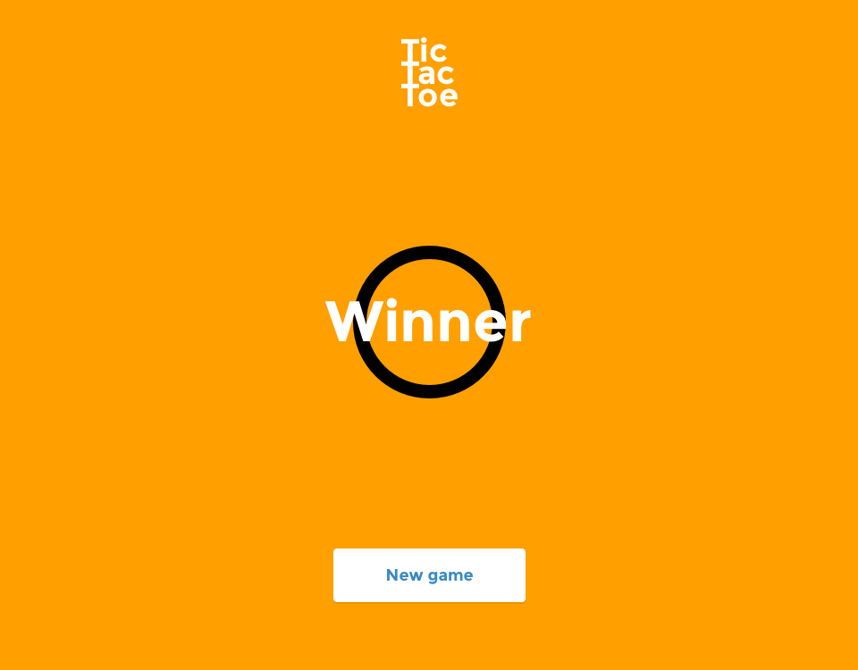

# Tic-Tac-Toe Game
>Treehouse Techdegree Project #4

Built a functional, two-person Tic Tac Toe game.  As soon as the game starts, it requires players to add their names, take turns adding an X or O to the game board and announce when the game ends. When the game ends, the board disappears and the game end screen appears. If a player wants to do game again, push the "New Game" button. 

## Images In ReadMes
### Start Page

### Game Board

### Winner Page

